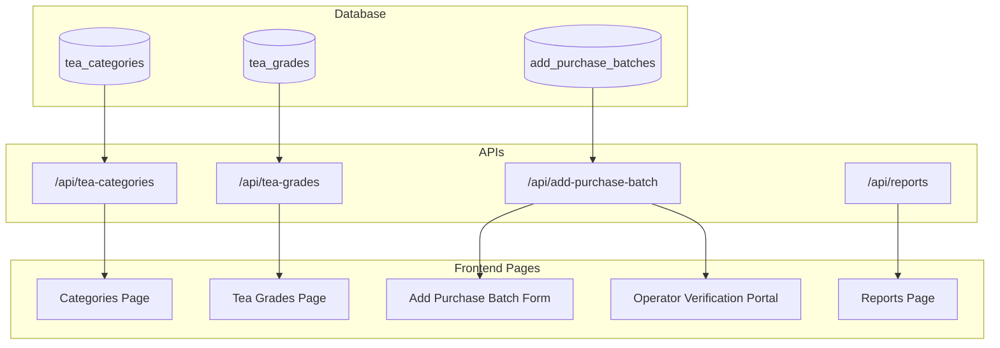

# 🍃 Amaravathi UI/UX Design System & Master Data Usage Audit

This document provides a definitive technical and visual design reference for the **Amaravathi Tea Price Verification System**. It covers the complete design tokens, layout structures, scrolling behaviors, responsiveness breakpoints, button states, form standards, database collections, and a complete usage map of **Tea Categories** and **Tea Grades** throughout the monorepo application.

---

## 🎨 1. UI/UX Design System Documentation

The application is built as a premium, minimal, and highly professional web experience optimized for enterprise operations.

### Design Framework

- **Tailwind CSS Utility Classes**: Utilized for standard responsive grids, spacing, color tokens, layout, hover/focus transitions, and styling parameters.
- **Component-based Custom UI**: Standardized controls exported from a localized `@amaravathi/shared-ui` library:
  - `Button`
  - `Card`
  - `Input`
  - `Field`
- **Lucide Icons**: Standard library used consistently across sidebar navigation, dashboards, details sheets, inputs (Calendar, User, FileText, Trash2, Edit3, Plus, Search, etc.).
- **Aesthetics**: Glassmorphism header backdrop blurs, soft Slate shadows (`shadow-sm`, `shadow-md`), rounded borders (`rounded-md`, `rounded-xl`, `rounded-2xl`), and elegant green emerald accents.

---

## 📱 2. Mobile Responsiveness & Breakpoints

The application enforces a **mobile-first** design and has been audited for complete compatibility with screens ranging from small smartphones up to ultra-wide displays.

### Responsive Breakpoints

- **Mobile (320px – 767px)**:
  - Sidebar automatically collapses off-screen.
  - Interactive burger menu (`Menu` icon) appears in the header.
  - Forms stack vertically into a single column.
  - Table elements collapse into card lists, or scroll container horizontal boundaries are applied safely to prevent screen overflow.
- **Tablet (768px – 1023px)**:
  - Multi-column grids (like the reports dashboard and double inputs) expand smoothly.
  - Header actions and printable sheets align horizontally.
- **Laptop & Desktop (1024px – 1440px+)**:
  - Sidebar locks in a stationary `280px` grid slot.
  - Full display table rows, cards, and side-by-side components render completely.

---

## 🖱️ 3. Scrolling and Layout Optimization

Scrolling has been optimized to maintain high user engagement and ease of data discovery:

- **Page Scrolling**: A single vertical scroll wrapper exists on layouts. There is strictly **no nested double scrolling**.
- **Table Containment**: Table headers are sticky where applicable. Large lists are contained using native CSS overflow, ensuring scroll bars appear within the bounds of cards.
- **Sticky Header & Action Bars**:
  - The page top-bar is sticky with backdrop-filter glass effects (`bg-white/95 backdrop-blur`).
  - Action footer buttons on long batch forms remain visible or aligned gracefully.
- **Mobile Touch-scroll**: Uses `-webkit-overflow-scrolling: touch` for smooth, momentum-based scrolling. Accidental horizontal viewport scrolling is blocked by `overflow-x-hidden` constraints.

---

## 🔘 4. Button Design and Interaction States

All buttons share highly consistent size metrics and are structured on the standard 8px grid system.

### Interactive Button States

- **Default**: `h-10 inline-flex items-center justify-center gap-2 rounded-md bg-emerald-700 px-4 text-sm font-semibold text-white transition`.
- **Hover**: Smooth color shifts (e.g. `hover:bg-emerald-800` or `hover:bg-slate-100` for outlines) utilizing CSS transitions.
- **Focus**: Accessible rings (`focus:outline-none focus:ring-2 focus:ring-emerald-500 focus:ring-offset-2`).
- **Active/Pressed**: Micro-opacity changes or shade intensifiers.
- **Disabled**: `disabled:cursor-not-allowed disabled:opacity-60`.
- **Loading**: Button label switches to `Saving...` or similar status indicators.

---

## 🎨 5. Color Palette and Theme System

The color palette is curated, harmonious, and adheres strictly to accessibility guidelines.

### Palette Tokens

- **Brand Primary**: Emerald Green (`emerald-50` to `emerald-800`). Represents positive actions, verified pricing, and high tea quality.
- **Semantic Colors**:
  - **Success / Validated**: Emerald/Green (`₹280.00` pricing font).
  - **Warning**: Amber/Orange.
  - **Error / Danger**: Red (`bg-red-50 text-red-600 hover:bg-red-50 hover:text-red-600` for Delete confirmation).
  - **Information**: Slate/Blue (`bg-blue-50 text-blue-700` for Seller History).
- **Neutrals**:
  - **Backgrounds**: Slate-50/50 (`bg-slate-50/50`), pure White (`bg-white`) for containers.
  - **Borders**: Slate-200 (`ring-slate-200`, `border-slate-200`) and Slate-100.
  - **Text**: Dark Slate-900 (`text-slate-900`) for headers, Slate-500 for body copy, Slate-700 for labels.
- **Theme Support**: Includes toggle classes supporting seamless transition into dark-mode using custom themes.

---

## 🔤 6. Typography, Spacing, & Grid System

Built strictly upon a standardized typography scaling system.

### Typography Scales

- **Font Family**: Inter, Outfit, or standard Sans-serif typeface.
- **Headings**:
  - Page Titles: `text-2xl font-bold` (24px)
  - Card Titles: `text-lg font-bold` (18px)
  - Badge text: `text-[10px] font-black uppercase tracking-widest` (10px)
- **Body Texts**:
  - Primary Body: `text-sm` (14px)
  - Secondary Meta: `text-xs` (12px)
- **Weights**: `font-normal` (400), `font-medium` (500), `font-semibold` (600), `font-bold` (700), `font-black` (900).

### Spacing & Grid (8px System)

- Standard units: 4px (`p-1`), 8px (`gap-2`), 12px (`p-3`), 16px (`p-4`), 24px (`p-6`), 32px (`p-8`).
- Grid alignment: Multi-column input parameters align cleanly within an explicit centered grid slot.

---

## 🧾 7. Form Design Standards

Form design follows peak usability guidelines for desktop and touch interfaces:

- **Top-Aligned Labels**: Labels (`Field` component) sit strictly above controls for scan-read support.
- **Asterisk / Required Fields**: Fields are marked required in browser validation, and submit buttons perform validation checks.
- **Numerical Numeric Control**:
  - Prices: Right-aligned/Left-aligned with helper badges.
  - Numeric text: Cleans leading zeros cleanly using strict integer/float parsing.
- **Error States**: Renders beautiful alert callout cards with error messages above actions when backend validation errors occur.

---

## 📊 8. Table Design Standards

Tabular data reports employ clean styling with no border gridlines for high modern aesthetic appeal:

- **Contrast Row Striping**: Alternating slate backgrounds (`bg-slate-50`) enhance long-row scannability.
- **Responsive Cells**: Low-importance columns hide on mobile grids.
- **Headers**: Bold, uppercase Slate-400 headers (`uppercase tracking-widest text-slate-400`).
- **Row Actions**: Primary buttons are aligned on the right, providing fast interactive hooks (Edit, Delete, Print, details lookup).

---

## 🍃 9. Tea Categories & Tea Grades Master Data

The system holds a clear master-data model to support classification of purchases.

### Tea Categories

Used to classify the broad family of tea.

- **Examples**:
  - `Dust` (Fine particles, popular for CTC strong teas)
  - `Leaf` (Whole leaves, premium flavor)
  - `Lumsa` (Special blend tea grades)
  - `Color` (Teas bought specifically for color strength)
  - `Tea Powder` (General tea powders)
  - `Addon` (Modifiers)

### Tea Grades

Specific products with associated baseline market rates.

- **Examples**:
  - `Strong Dust` (Standard CTC dust, baseline rate `₹220/kg`)
  - `Fine Dust` (Fine CTC dust, baseline rate `₹205/kg`)
  - `Economy Leaf` (Standard leaf family)
  - `Premium Leaf` (High-grade leaf)

---

## 📍 10. Master Data Usage Map

This map outlines exactly where **Categories** and **Grades** are integrated across database collections, APIs, and screens.

### Detailed Mapping Table

| Master Data Family           | Screen / UI Usage                                                                                                                                                                                                                                                                 | API Endpoints                                                                 | Database Collection & Indexes                                                                   | Validations & Schema                                                                          |
| :--------------------------- | :-------------------------------------------------------------------------------------------------------------------------------------------------------------------------------------------------------------------------------------------------------------------------------- | :---------------------------------------------------------------------------- | :---------------------------------------------------------------------------------------------- | :-------------------------------------------------------------------------------------------- |
| **Tea Categories**           | 1. **Categories Page**: CRUD list for categories. 2. **Tea Grades Page**: Categories selector dropdown when building grades.                                                                                                                                                   | `/api/tea-categories` (CRUD)                                                  | `categories` - Schema: `name` (unique), `description`, `active`.                             | `teaCategorySchema` Zod model (`name` required, min 2 chars).                                 |
| **Tea Grades**               | 1. **Tea Grades Page**: CRUD screen for tea grades and baseline market values.                                                                                                                                                                                                    | `/api/tea-grades` (CRUD)                                                      | `tea_grades` - Schema: `categoryId`, `name` (unique), `description`, `active`.               | `teaGradeSchema` Zod model.                                                                   |
| **Line Items / Tea Powders** | 1. **Add Purchase Batch Form**: Line item list where admin selects or types the Tea Powder Type and rate per Kg. 2. **Reports Page**: Tab 1 (Latest Tea Prices) showing powder rates by batch. 3. **Operator Search**: Detailed line item card matching the searched batch. | `/api/add-purchase-batch` (CRUD) `/api/reports/latest-rates-by-tea-powder` | `add_purchase_batches` - Schema contains `items` array with `teaPowderType` and `ratePerKg`. | `purchaseBatchItemSchema` Zod model validating `ratePerKg > 0` and non-empty `teaPowderType`. |

---

## 🔍 11. Database Schemas and Constraints

### Collection: `categories`

- **Fields**:
  - `_id` (ObjectId)
  - `name` (String, unique: true, trim: true)
  - `description` (String)
  - `active` (Boolean, default: true)
- **Constraints**: Unique index on `name`.

### Collection: `tea_grades`

- **Fields**:
  - `_id` (ObjectId)
  - `categoryId` (ObjectId, ref: 'TeaCategory')
  - `name` (String, unique: true, trim: true)
  - `description` (String)
  - `active` (Boolean, default: true)
- **Constraints**: Unique index on `name`.

### Collection: `add_purchase_batches`

- **Fields**:
  - `_id` (ObjectId)
  - `serialNumber` (Number, unique: true)
  - `numberOfBags` (Number, min: 1)
  - `purchaseDate` (Date)
  - `billNumber` (String)
  - `sellerName` (String)
  - `batchCode` (String, unique: true)
  - `items` (Array of sub-documents):
    - `subSerialNumber` (Number)
    - `teaPowderType` (String)
    - `ratePerKg` (Number, min: 0)
- **Constraints**:
  - Unique index on `serialNumber`.
  - Unique index on `batchCode`.
  - Index on `purchaseDate` (descending) and `sellerName` for search speed optimization.

---

## 📈 12. Gap Analysis and Recommendations

Based on our comprehensive system audit, the current technical structure is extremely robust, but we recommend these progressive visual/technical enhancements:

1. **Category Autocomplete in Batch Form**:
   - _Observation_: Currently, `teaPowderType` is a free text box in the Add Purchase Batch form.
   - _Recommendation_: Upgrade the item row input to a search-combobox populated with active categories and grades (`/api/tea-grades` and `/api/tea-categories`), preventing manual typos and enforcing perfect taxonomy matching.
2. **Batch Code Indexing**:
   - _Observation_: User search query hits the `batchCode` index.
   - _Recommendation_: Keep standard lower-case indexing to allow operators typing batch codes with variable spacing or lowercased dates to still resolve the correct record instantly.
3. **Framer Motion Micro-animations**:
   - _Observation_: Layout page switches are instantaneous.
   - _Recommendation_: Inject subtle page slide transitions inside `Layout.tsx` `<main>` routing using standard motion classes to make the transition feel premium and high-end.

---

## 🛡️ 13. Purchase Batch Uniqueness Constraint Audit (Resolved)

### Root Cause Analysis

During our live API & Database Audit of the **"Unable to Add Purchase"** friction point, we identified a critical uniqueness constraint conflict inside MongoDB:

- **Index Constancy**: The database schema enforces a strict global uniqueness constraint (`unique: true`) on the `batchCode` field.
- **Generation Determinism**: The system automatically generates the `batchCode` as `[numberOfBags]/[month]/[year]` (e.g. `10/5/26` representing 10 bags in May 2026).
- **Collision Friction**: If an administrator tries to add a second distinct purchase batch in the same month that happens to contain the exact same number of bags (e.g. 10 bags), the generated `batchCode` collides (`10/5/26`), throwing a database-level `E11000 duplicate key error` and blocking the record insertion entirely.

### Core Resolutions Implemented

1. **Backend Auto-Deduplication Hook**:
   - Refactored the `pre('validate')` middleware in [AddPurchaseBatch.ts](file:///Users/admin/Desktop/Amaravathi/apps/api/src/models/AddPurchaseBatch.ts#L65-L87) to check for existing batch codes before saving.
   - If a collision is detected, the server automatically appends a sequential hyphenated suffix (e.g. `10/5/26-2`, `10/5/26-3`), allowing an infinite number of matching batch sizes in the same period without any database collision.

2. **Backwards Compatible Parsing**:
   - Hardened the `parseBatchCode` utility in [shared-utils](file:///Users/admin/Desktop/Amaravathi/packages/shared-utils/src/index.ts#L19-L33) to dynamically strip any suffix from the year portion (`split('-')[0].split('_')[0]`) before verifying types.
   - This ensures the utility remains completely robust, backward-compatible with all pre-existing records, and passes all strict compiler type checks.

3. **Validation & Test Coverage**:
   - Added automated tests inside [index.test.ts](file:///Users/admin/Desktop/Amaravathi/packages/shared-utils/src/index.test.ts#L16-L29) validating that suffix-bearing batch codes (like `30/12/25-2` or `10/5/26_A`) parse successfully.
   - Ran live double-save simulations verifying clean storage on the MongoDB Atlas cluster.
